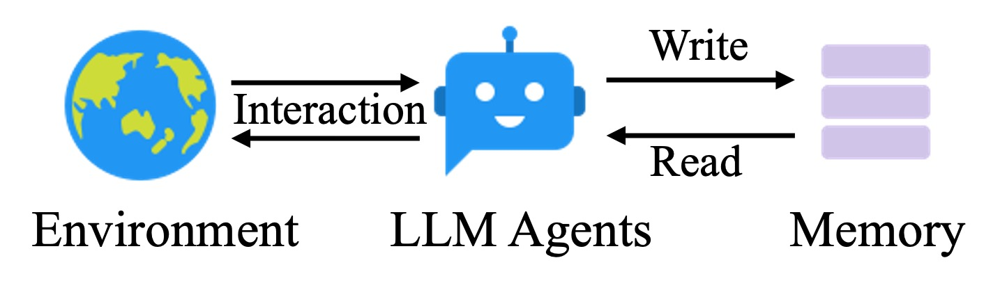
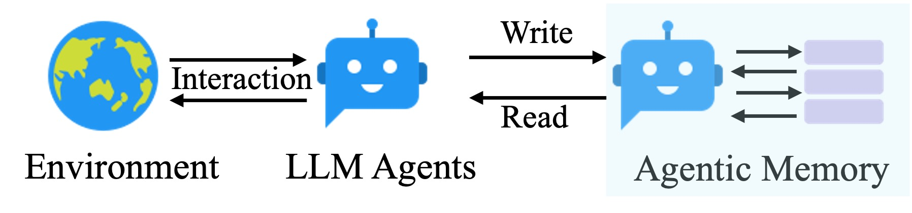
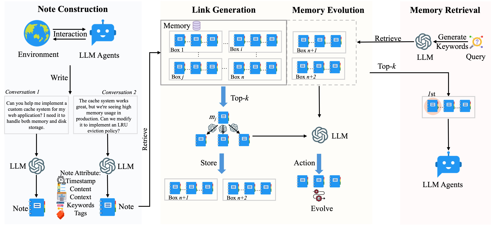

# Agentic Memory 🧠

A novel agentic memory system for LLM agents that can dynamically organize memories in an agentic way.

> **Note:** This repository is specifically designed to reproduce the results presented in our paper. If you want to use the A-MEM system in building your agents, please refer to our official implementation at: [A-mem-sys](https://github.com/WujiangXu/A-mem-sys)

For more details, please refer to our paper: [A-MEM: Agentic Memory for LLM Agents](https://arxiv.org/pdf/2502.12110)

## Introduction 🌟

Large Language Model (LLM) agents have demonstrated remarkable capabilities in handling complex real-world tasks through external tool usage. However, to effectively leverage historical experiences, they require sophisticated memory systems. Traditional memory systems, while providing basic storage and retrieval functionality, often lack advanced memory organization capabilities.

Our project introduces an innovative **Agentic Memory** system that revolutionizes how LLM agents manage and utilize their memories:

<div align="center">
  
  
  <br>
  <em>Comparison between traditional memory system (top) and our proposed agentic memory (bottom). Our system enables dynamic memory operations and flexible agent-memory interactions.</em>
</div>

## Key Features ✨

- 🔄 Dynamic memory organization based on Zettelkasten principles
- 🔍 Intelligent indexing and linking of memories
- 📝 Comprehensive note generation with structured attributes
- 🌐 Interconnected knowledge networks
- 🔄 Continuous memory evolution and refinement
- 🤖 Agent-driven decision making for adaptive memory management

## Framework 🏗️

<div align="center">
  
  <br>
  <em>The framework of our Agentic Memory system showing the dynamic interaction between LLM agents and memory components.</em>
</div>

## How It Works 🛠️

When a new memory is added to the system:
1. Generates comprehensive notes with structured attributes
2. Creates contextual descriptions and tags
3. Analyzes historical memories for relevant connections
4. Establishes meaningful links based on similarities
5. Enables dynamic memory evolution and updates

## Results 📊

Empirical experiments conducted on six foundation models demonstrate superior performance compared to existing SOTA baselines.

## Getting Started 🚀

1. Clone the repository:
```bash
git clone https://github.com/WujiangXu/AgenticMemory.git
cd AgenticMemory
```

2. Install dependencies:
Option 1: Using venv (Python virtual environment)
```bash
# Create and activate virtual environment
python -m venv a-mem
source a-mem/bin/activate  # Linux/Mac
a-mem\Scripts\activate     # Windows

# Install dependencies
pip install -r requirements.txt
```

Option 2: Using Conda
```bash
# Create and activate conda environment
conda create -n myenv python=3.9
conda activate myenv

# Install dependencies
pip install -r requirements.txt
```

3. Run the experiments in LoCoMo dataset:
```python
python test_advanced.py 
```

**Note:** To achieve the optimal performance reported in our paper, please adjust the hyperparameter k value accordingly.

**Categories Information:** The LoCoMo dataset contains the following categories:
* Category 1: Multi-hop
* Category 2: Temporal
* Category 3: Open-domain
* Category 4: Single-hop
* Category 5: Adversarial

For more details about the categories, please refer to [this GitHub issue](https://github.com/snap-research/locomo/issues/6). 

## Citation 📚

If you use this code in your research, please cite our work:

```bibtex
@inproceedings{xu2025amem,
  title={A-mem: Agentic memory for llm agents},
  author={Xu, Wujiang and Liang, Zujie and Mei, Kai and Gao, Hang and Tan, Juntao and Zhang, Yongfeng},
  booktitle={Advances in Neural Information Processing Systems},
  year={2025}
}
```

## License 📄

This project is licensed under the MIT License. See LICENSE for details.


